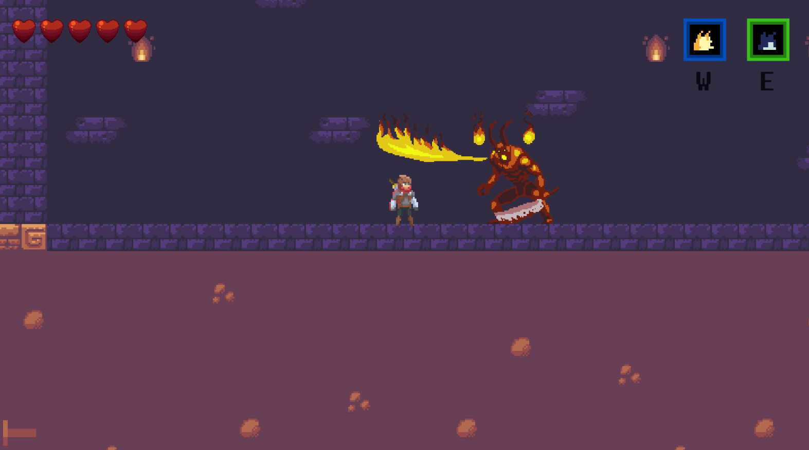
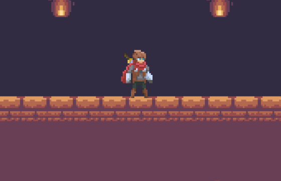
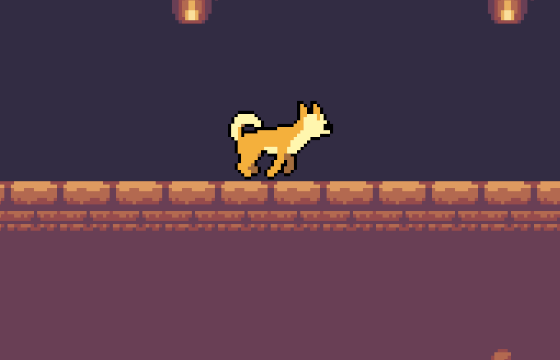
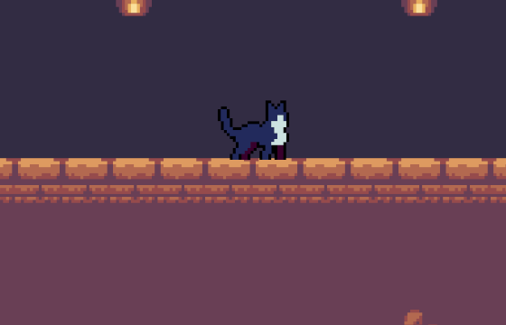
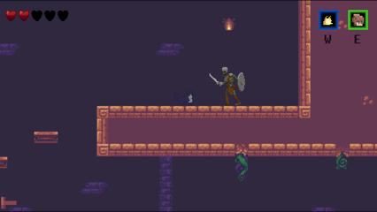
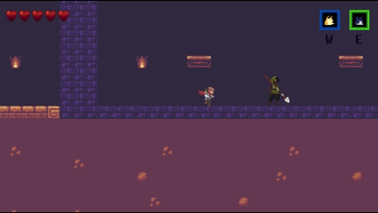
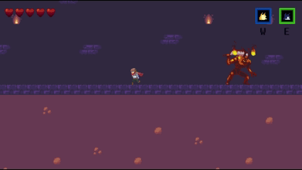
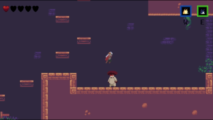
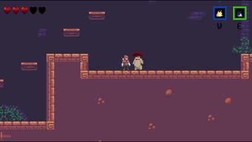

# Animal Adventure — 2D 변신 메트로배니아

> 인간 · 개 · 고양이로 **몸을 바꿔가며** 길을 여는 2D 횡스크롤 액션.
> 세 형태가 각각 다른 이동 물리와 능력을 갖고, 같은 방도 어떤 몸으로 들어가느냐에 따라 다른 길이 된다.



| 항목 | 내용 |
|---|---|
| 장르 | 2D 메트로배니아 (탐험 · 능력 해금 · 보스전) |
| 플랫폼 | PC · 싱글플레이 |
| 엔진 | Unity 6000.3.15f1 (URP 2D) |
| 주요 패키지 | Input System · Cinemachine 3.1 · UniTask · 2D Aseprite/PSD Importer · Tilemap |
| 개발 기간 | 2026.05.17 ~ 2026.06.23 (약 5주) |
| 인원 | **1인 개발** (기획 · 구현 전부) |
| 규모 | 스크립트 113개 · 약 10,200줄 · 커밋 151개 |

---

## 1. 게임 소개

### 머무는 변신, 스치는 변신

변신은 연출이 아니라 **조작 규칙 자체를 바꾸는 장치**다. 형태마다 콜라이더 크기, 최고 속도, 가·감속 시간, 공중 제어력, 점프 속도, 상승·하강 중력, 점프컷 배율이 전부 다르게 잡혀 있고 이 값들은 `TransformationData`(ScriptableObject)에 들어 있다.

두 변신은 **머무는 시간이 다르다.** 고양이는 들어가서 머무르며 판단하는 폼이고, 개는 한 동작을 위해 스쳐 지나가는 폼이다 — 키를 누르는 순간 변신하고, 돌진이 끝나면 알아서 인간으로 돌아온다.

| 형태 | 성격 | 능력 |
|---|---|---|
| **인간** | 기본 · 계속 머문다 | 근접 공격 · 대시 |
| **개** | 순간형 — 한 동작만 하고 빠진다 | **돌진 공격** — 변신 키가 곧 스킬 발동이다. 수평으로 돌진해 첫 적을 때리고, 강타 정지 후 물러나며 **자동으로 인간으로 돌아온다**. 명중한 적에게 약점을 남긴다 (쿨타임 7초) |
| **고양이** | 지속형 — 들어가서 머문다 | 멈춰 있으면 **은신** — 시야 콘 적에게 감지되지 않고 접촉 피해도 무효. 단, 은신 중 이동 가능 거리는 2.25m로 제한 |

| 인간 | 개 | 고양이 |
|:--:|:--:|:--:|
|  |  |  |



*고양이 은신 — 멈춰 있는 동안은 적이 바로 옆을 지나도 반응하지 않는다.*

### 약점 시스템 — 개로 열고, 인간으로 두들긴다

개의 돌진에 맞은 적은 **약점이 노출되고, 그동안 받는 피해가 2배**가 된다. 돌진이 끝나면 인간으로 돌아와 있으므로, 플레이어는 자기가 만든 창에 그대로 화력을 쏟으면 된다. 잡몹은 돌진만 맞히면 열리지만 **보스는 그로기 상태에서만** 약점이 잡힌다 — 보스전이 "패턴을 흘려보내 그로기를 만들고 → 돌진을 꽂고 → 노출된 창을 두들기는" 리듬이 되는 이유다.

> **설계 변경 (개발 중반).** 처음에는 **개로 변신 → 스캔으로 마킹 → 인간으로 복귀 → 타격**의 4단계였다. 조작이 길어 창이 열리기 전에 리듬이 끊겼고, 무엇보다 **플레이어가 네 번 생각해야 하는 일을 한 번에 하고 싶어했다.** 스캔을 걷어내고 돌진 공격 하나에 "때린다 + 약점을 남긴다 + 인간으로 돌아온다"를 묶었다. 기능을 더한 게 아니라 **단계를 없애서** 같은 결과를 냈다.



*개로 바뀌는 순간이 곧 돌진이다. 꽂고 나면 인간으로 돌아와 있고, 약점이 열린 적을 그대로 두들긴다.*

---

## 2. 아키텍처

혼자 만드는 프로젝트일수록 **나중의 내가 읽을 수 있는 구조**가 중요하다고 보고, 세 가지 규칙을 정해 끝까지 지켰다.

```
입력 ──▶ PlayerInputHandler ──▶ PlayerTransformController ──▶ ITransformState (Human · Dog · Cat)
                                          │                         │
                                          ▼                         ▼
                              TransformationData (SO)      각 폼 전용 컴포넌트 on/off
```

- **상태는 클래스로, 수치는 데이터로** — 폼 전환은 `ITransformState`(Enter/Exit)로, 폼별 수치는 ScriptableObject로 갈랐다. 밸런스를 고치는 데 코드를 건드리지 않는다. 보스도 같은 방식이다 — `BossStateMachine` + `BossStateBase`(Intro / Phase1 / Phase2 / Death).
- **능력은 컴포넌트 단위로 켜고 끈다** — `DogDashAttack`·`CatStealth`는 해당 폼의 `Enter`/`Exit`에서 `enabled`만 토글된다. 쿨타임은 `Time.time` 기준이라 **폼을 바꿔도 계속 흐른다** (변신으로 쿨타임을 리셋하는 편법 차단). 개는 스킬이 끝나면 `OnSkillCompleted`를 발행하고, 컨트롤러가 그 신호로 인간 폼을 되돌린다.
- **결합은 인터페이스와 이벤트로** — `IDamageable`·`IWeaknessTarget`·`IContactDamageImmune`. 플레이어 쪽 코드는 상대가 잡몹인지 보스인지 모른 채 같은 경로로 처리한다.

---

## 3. 주요 구현

### 3-1. 변신 시스템

- 폼마다 콜라이더 크기·오프셋이 달라, 전환 시 **바닥을 뚫거나 천장에 끼지 않도록** 접지 판정과 함께 갱신한다.
- **해금제** — 개·고양이·대시는 아이템으로 열린다(`AbilityUnlockItemData`). 잠긴 능력으로 변신을 시도하면 `OnLockedAbilityAttempted` 이벤트가 발행돼 UI가 피드백을 띄운다. 즉 "왜 안 되는지"가 침묵으로 남지 않는다.
- **고양이 → 인간 복귀 직후의 유예(sneak window)** — 은신을 풀고 인간으로 돌아온 직후 일정 시간 동안은 적이 감지를 무효 처리한다. 변신 프레임에 바로 발각되면 잠입이 성립하지 않기 때문이다.

### 3-2. 적 · 보스

- 잡몹은 공용 FSM(`Idle → Patrol → Detect → Chase → Combat → Attack`)을 쓰고, 공격 방식만 `IEnemyAttack`(근접 / 원거리)으로 갈아 끼운다. 파생: 지상 사수, 비행 사수, 엘리트, **감시병**(시야 콘 순찰 — 비밀방 게이트키퍼), 반격형.
- **감시병의 감지 규칙이 고양이 잠입의 난이도 축이다** — 정지 시 감지 불가, 이동 시 감지 거리 60%, 점프·낙하 중에는 정상 감지. "멈추면 안 보이지만 뛰면 보인다"가 규칙으로 명시돼 있다.
- 보스 2종은 페이즈 전환형이며, **그로기일 때만 약점이 열린다**(`CanBeSensedExternally`). 돌진을 아무 때나 꽂는 게 아니라 **열리는 순간을 노려 꽂는** 것이 보스전의 과제다.
- 투사체는 `UnityEngine.Pool` 기반 풀에서 꺼내 쓰며, 에디터에서는 `collectionCheck`로 이중 반환을 잡는다.



*보스전 — 화염 패턴을 피하며 그로기를 기다린다.*

### 3-3. 손에 맞추는 보정 — 입력 유예 · 포고 · 히트스톱

플랫포머에서 "눌렀는데 안 됐다"는 대부분 플레이어가 틀린 게 아니라 **판정이 사람의 손을 못 따라간 것**이다. 입력과 결과 사이를 네 가지로 보정했다.

- **코요테 타임 0.1초** — 발판에서 발이 떨어진 뒤에도 잠깐은 점프가 성립한다.
- **점프 버퍼 0.1초** — 착지하기 직전에 미리 누른 점프를 기억했다가 닿는 순간 실행한다. 코요테 타임이 "늦게 누른 것"을, 버퍼가 "일찍 누른 것"을 받아준다 — **둘이 같이 있어야** 한쪽 방향의 실수만 봐주는 일이 없다.
- **공격 버퍼 0.1초** — 같은 규칙을 공격 입력에도 적용했다.
- **포고 (아래 공격 반동)** — 공중에서 아래를 치면 적을 밟고 튀어오른다. 반동은 기존 속도에 **더하지 않고 `velocity.y`에 직접 대입**한다 — 얼마나 빠르게 떨어지던 중이었든 **튀는 높이가 항상 같아야** 연속 포고의 리듬을 눈으로 예측할 수 있기 때문이다. 대신 점프 횟수는 리셋하지 않아 공중에서 무한히 도망칠 수는 없다. 위 공격은 반대로 몸이 아래로 눌리고, 옆 공격은 때린 반대 방향으로 밀린다.
- **히트스톱** — 강도를 5등급(잡몹 / 적 피격 / 보스 / 백스탭·마무리 / 플레이어 피격)으로 나눠 상황마다 정지 길이를 달리한다. 연출 요소(VFX·UI 애니메이터·파티클)는 Unscaled Time으로 돌려 정지 중에도 살아 있게 했다.

|  |  |
|:--:|:--:|
|  |  |
| **포고** — 아래 공격이 맞으면 밟고 튀어오른다 | 밟고 올라가 공중에서 계속 이어간다 |

> 수치는 전부 인스펙터에 노출해 두고 **직접 플레이하며 맞췄다.** 0.1초라는 값 자체보다, "무엇을 봐주고 무엇은 봐주지 않을지"를 정하는 쪽이 오래 걸렸다.

### 3-4. 진행 저장

- `GameState`(DontDestroyOnLoad)가 능력 해금·열린 문·수집 아이템·체크포인트·HP를 씬 너머로 들고 다닌다.
- `SaveManager`는 **슬롯 3개의 JSON**을 `persistentDataPath`에 쓴다. 체크포인트를 밟으면 자동 저장되고, 타이틀에서 슬롯 정보를 미리 보고 고른다.
- **미니맵은 좌표를 손으로 찍지 않는다** — 방마다 `MapRoomDefinition`을 두고, 루트 방을 (0,0)으로 삼아 연결 관계를 따라 **그리드 칸을 자동 배치**한다. 맵 씬을 추가해도 지도 좌표를 새로 계산할 필요가 없다.

---

## 4. 기술적으로 판 문제

### (1) 히트스톱이 풀리지 않고 게임이 멈추던 문제

- **증상** — 타격 순간 `Time.timeScale = 0`으로 전체를 세우는 방식이었는데, 정지 중에 플레이어가 죽어 파괴되면 **timeScale을 0으로 되돌릴 주체가 사라져** 게임이 그대로 굳었다.
- **원인** — 정지의 소유자가 **일시적인 오브젝트(Player)** 였다. 정지 시간을 재는 코루틴이 그 오브젝트에 얹혀 있었으니, 오브젝트가 사라지면 복구도 사라진다.
- **해결** — 전역 정지의 소유권을 **DontDestroyOnLoad 매니저**로 옮겼다. 정지 주체와 정지 대상을 분리한 것이고, 재진입은 누적이 아니라 **더 긴 쪽으로 연장**하도록 정의해 연타 시 정지가 쌓이지 않게 했다.

### (2) 보스가 방향을 틀면 투사체까지 뒤집히던 버그

- 투사체를 보스의 자식으로 생성한 탓에 **부모의 flip(스케일 반전)을 상속**받아, 발사 뒤 보스가 돌아서면 날아가던 투사체의 방향까지 꺾였다.
- 투사체를 **월드 루트에 생성**하도록 바꿔 부모 변환에서 떼어냈다. 발사된 순간의 방향은 발사체 자신의 것이어야 한다는 원칙을 그때 세웠다.

### (3) 투사체 생성·파괴 비용 — 오브젝트 풀링

보스 패턴은 투사체를 연사한다. 매번 Instantiate/Destroy하면 GC가 튀므로 `UnityEngine.Pool`로 전환했다. 기본 용량 10 · 최대 20으로 잡고, 반환 시 상태를 초기화한다.

---

## 5. 저장소 구조

```
Assets/
  Scripts/
    Player/          이동 · 점프 · 대시 · 공격 · 입력 · 변신 컨트롤러
      Transformations/  ITransformState · Human/Dog/Cat State · TransformationData
    Enemy/           공용 FSM · 근접/원거리 공격 · 감시병 · 엘리트 · 반격
    Boss/            BossBase · 상태 머신 · 페이즈 상태 · 투사체 풀
    Combat/          Health · 히트박스 · 접촉 피해 · 약점 인터페이스/레지스트리
    Item/            아이템 SO(능력 해금 · 회복 · 열쇠 · 최대 HP) · 데이터베이스 · 습득
    Manager/         GameState · Save · Inventory · Audio · HitStop · Pause · 씬 전환 · 튜토리얼
    Map/             체크포인트 · 구역 전환 · 잠긴 문 · 비밀방 · 보스룸 · 스테이지 클리어
    UI/              HUD · 지도 · 세이브 슬롯 · 보스 그로기 · 약점 마커 · 타이틀
    Effects/ Audio/  이펙트 스포너 · 스프라이트시트 연출 · 사운드 라이브러리
  Scenes/            Title · Map1 ~ Map8
  ScriptableObjects/ Transformations(3) · Items(6)
```

---

## 6. 실행

```bash
git clone https://github.com/hyunjin0814/minigame-project-backup.git
```

1. **Unity 6000.3.15f1** 로 프로젝트를 연다.
2. 시작 씬은 `Assets/Scenes/Title.unity`.
3. 세이브 파일은 `Application.persistentDataPath`에 슬롯별 JSON으로 생성된다.

---

## 7. 개발 기록

- 5주간 **커밋 151개**, 전부 1인 작업.
- 기능 단위로 브랜치를 파고 **Pull Request로 병합**하는 방식을 혼자서도 유지했다 (`object-pool`, `bug-fixed` 등).
- 커밋 메시지는 `feat:` · `fix(boss):` 처럼 범위를 붙여 남겼다.
